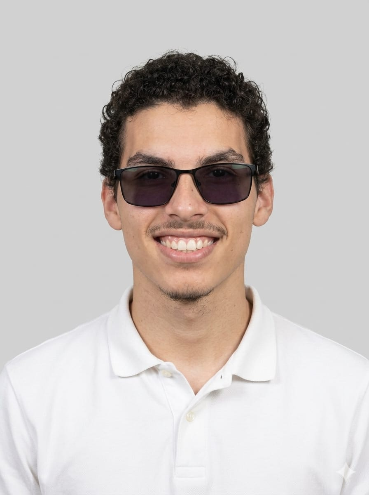

# Olá, eu sou Rodrigo! 👋

  

##  Sobre mim

Sou estudante de Ciência da Computação e estou construindo minha carreira na área de tecnologia. Atualmente, meus estudos estão voltados para o desenvolvimento em ABAP, com foco em aprender continuamente e desenvolver soluções que contribuam para a evolução de empresas e pessoas.

## Tecnologias e estudos

- ABAP (em desenvolvimento)
- Lógica de Programação
- Algoritmos
- SAP ABAP (fundamentos)

##  Objetivos

- Aprimorar meus conhecimentos em ABAP e no ecossistema SAP.
- Desenvolver projetos práticos para fortalecer minhas habilidades.
- Conquistar minha primeira oportunidade na área de tecnologia.

## Projetos

- Exercícios e algoritmos desenvolvidos durante os estudos de ABAP.
- Projetos acadêmicos desenvolvidos ao longo da graduação em Ciência da Computação.

## Contato

- GitHub: https://github.com/rodrigoabap-debug
